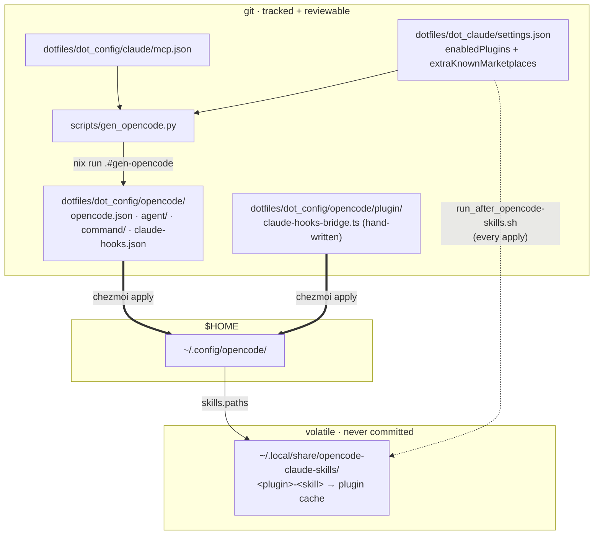

# opencode — parity with the Claude Code setup

[opencode](https://opencode.ai) runs beside `claude` and `codex` on every host. Its config is
**not** hand-written: `nix run .#gen-opencode` derives it from the Claude artifacts this repo
already tracks, so the two agents cannot drift apart. Read
[mcp-servers.md](mcp-servers.md) first — the secret channel described there is the one
opencode reuses.

## Why a generator and not a second config

opencode and Claude Code overlap almost completely in *capability* and almost not at all in
*file format*. Every difference below was verified against opencode 1.18.29, not assumed:

| Thing | Claude Code | opencode | Consequence |
|---|---|---|---|
| Env interpolation | `${VAR}` | `{env:VAR}` | `mcp.json` **cannot** be shared; it is translated |
| MCP transport key | `"type": "http"` | `"type": "remote"` | renamed on translation |
| Personal skills | `~/.claude/skills/` | reads the **same path** natively | free, nothing to do |
| Plugin skills | `~/.claude/plugins/cache/**` | not read | needs the symlink farm |
| `skills.paths` globs | n/a | **not expanded** | farm must hold literal dirs |
| Agents | `~/.claude/agents` | own dir; name from **filename** | must be namespaced |
| Commands | `~/.claude/commands` | own dir | `allowed-tools` dropped |
| Hooks | `hooks.json` | none — TS plugins only | needs the bridge |
| Agent colour | `red`, `green`… | `#RRGGBB` or semantic name | **hard-fails startup** if unmapped |

`interpolation`, `skills.paths` glob behaviour, and the `.claude/skills` read were each
confirmed with `opencode debug config` / `debug skill` against an isolated `XDG_CONFIG_HOME`.

## The two channels

The split falls on **stable vs. volatile**, which is the whole reason there are two.



**Why the farm exists at all.** Plugin skills live at
`~/.claude/plugins/cache/<market>/<plugin>/<VERSION>/skills`, and `skills.paths` takes literal
directories — globs silently match nothing. A generated literal list would be committed
already-rotting, and its failure mode is *silence*: opencode skips a missing path without a
warning. So `opencode.json` holds **one** stable path, the farm, and only the links move.

The farm lives under `~/.local/share`, deliberately **outside** chezmoi's tree. A managed
symlink whose target changes on every plugin update would report dirty forever, and a
managed-file collision is the "would be clobbered" failure that silently halts *all*
home-manager file updates (see [CLAUDE.md](../CLAUDE.md)).

Plugin skills are **not** linked into `~/.claude/skills` even though opencode reads it: Claude
Code reads it too, so every skill would load twice there.

## Auth — no new secrets

opencode reads `ANTHROPIC_BASE_URL` / `ANTHROPIC_AUTH_TOKEN`, which `secrets.fish` already
exports (they are the Lupina gateway pair). No Bitwarden item, no `FISHENV_MANIFEST` row.

⚠️ **The config pins them explicitly, and must keep doing so.** This box also exports a real
`ANTHROPIC_API_KEY`, and opencode's provider auto-detection picks *that* — so left ambient it
would bill the direct Anthropic account while Claude Code went through the gateway. Silent
divergence, not an error. `provider.anthropic.options` removes the ambiguity.

## Two gotchas that cost real debugging time

Both produce an **infinite hang with no failing HTTP status**, so neither is findable by
checking status codes. Recorded here so the next person does not re-derive them.

**1. `baseURL` must end in `/v1`.** `ANTHROPIC_BASE_URL` is the bare gateway origin — Claude
Code appends the version segment itself, so the var deliberately omits it. The AI SDK provider
opencode uses appends only `/messages`. Without the suffix opencode POSTs to `BASE/messages`,
which the gateway's **web UI** answers with `HTTP 200` and an HTML body. The SDK cannot parse
it, reports `AI_APICallError: Service Unavailable`, and retries forever.

```fish
# the tell — both return 200, only one is the API
curl -s "$ANTHROPIC_BASE_URL/messages"    -o - | head -c 20   # <!doctype html  ← wrong
curl -s "$ANTHROPIC_BASE_URL/v1/messages" -o - | head -c 20   # JSON/SSE        ← right
```

**2. `model` must be set explicitly.** With no `model` key opencode falls back to its own
default (`claude-sonnet-4-6`), which the pool rejects with `429 "Usage credits are required
for long context requests"` — again surfaced as a retry loop, not an error. The generator
derives the value from the tracked `settings.json` `model` alias via `MODEL_MAP`.

Diagnosing anything in this area: `opencode run --print-logs --log-level DEBUG`, and to see
the *actual* outbound request, point `ANTHROPIC_BASE_URL` at a local echo server — the request
path and headers are what give the game away.

## Routine tasks

```fish
nix run .#gen-opencode      # after enabling/disabling a Claude plugin, or editing mcp.json
chezmoi apply ~/.config/opencode
git add -A && git commit    # the generated tree is reviewable output, like manifests/
```

Adding an **MCP server** needs nothing extra: add it to `mcp.json` the usual way
([mcp-servers.md](mcp-servers.md)), then regenerate. Adding a **plugin** likewise — enable it
in Claude Code, `czadd ~/.claude/settings.json`, regenerate. Skills alone need no regeneration
at all; the farm picks them up on the next `chezmoi apply`.

## Known parity gaps

These are deliberate. Each is a case where a faithful port was impossible or actively unsafe:

- **Agent tool restrictions are dropped.** Claude's `tools:` is an allowlist; opencode's
  `tools` map defaults everything to `true`, so reproducing a restriction needs an explicit
  `false` for every tool *not* listed, against a tool set that differs between the two. A
  partial map would silently *widen* access, which is worse than not restricting.
- **Agent `model:` is dropped.** Claude uses bare aliases (`opus`); opencode needs
  `provider/model` and the gateway's exact ids are not knowable at generation time. Agents
  inherit the session model, which is the intended one anyway.
- **`PreCompact` hooks are dropped** — opencode has no analogue.
- **Datadog hooks are skipped** — macOS-only, so they can never fire on any host here.
- **Hooks cannot block a tool call.** Claude's `PreToolUse` can veto; opencode's
  `tool.execute.before` cannot. Handlers run for side effects and context, never as a gate.
- **`SessionStart` is emulated** on the first message of a session, and only with
  `source: "startup"` — opencode exposes no resume/clear/compact distinction, so matchers
  scoped to those variants never replay.

## Verify

```fish
opencode debug config | grep -c '{env:'   # must be 0 — anything left is an unset var
opencode debug skill  | jq length          # 42 plugin + 2 personal + 1 built-in
opencode agent list                        # 14 ported subagents + explore/general
nix run .#gen-opencode -- --check          # exit 1 = committed tree is stale
```

`--check` is the idempotency gate: generation is a pure read-and-transform (it never executes
a plugin hook handler and never touches `$HOME`), so a second run must produce a byte-identical
tree. All hook *execution* happens at runtime, inside the bridge.
